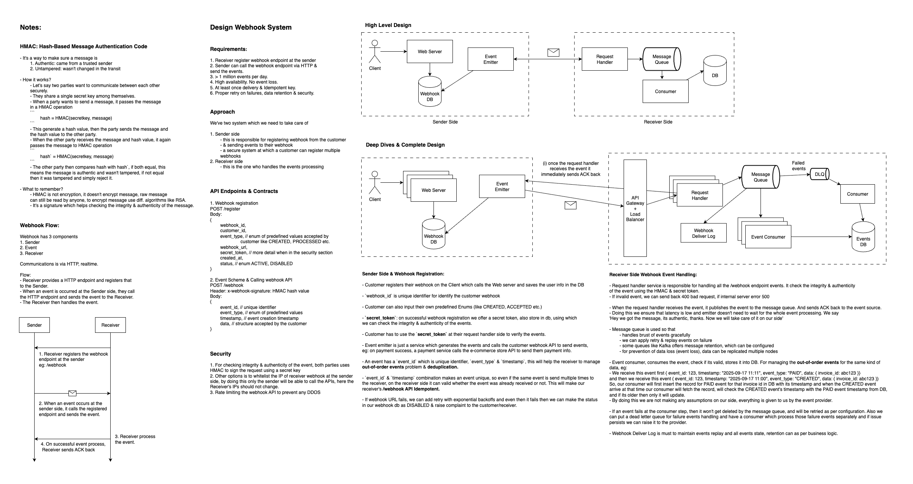

## Webhook System Prototype in Golang, Kafka, PostgreSQL

Read the blog for more implementation details: [TBA]

### Demo

### Tech Stack

- **Golang**: For all services.
- **Kafka**: Message broker for real-time data streaming.
- **Docker & Docker Compose**: Containerization and orchestration.
- **REST API**: Service communication.

### High Level Design



### Run this project

- Create `.env` file in the root folder.
  ```js
      ~/ cd golang-webhook-system
      ~/ touch .env
  ```
- Update the `.env` variables.

  ```sh

  ```

- Use Docker & Docker Compose for running the project.
  ```js
      ~/ docker compose up --build -d
      ~/ docker compose down
  ```

### API Reference

### References

1. https://pyemma.github.io/How-to-Design-Webhook/#security
2. https://beeceptor.com/docs/webhook-feature-design/#delivering-webhooks-at-scale-key-tech-design-considerations
3. https://systemdesignschool.io/problems/webhook/solution
4. https://tianpan.co/notes/166-designing-payment-webhook
